- 👋 Hi, I’m @hoshinorei
- 💻 I’m a frontend developer who enjoys building clean and practical web experiences
- 🚀 TypeScript is the language I use most and know best
- 🟢 Vue 3 is my go-to framework for building modern interfaces

My Programming time：

   

<!---
hoshinorei/hoshinorei is a ✨ special ✨ repository because its `README.md` (this file) appears on your GitHub profile.
You can click the Preview link to take a look at your changes.
--->
